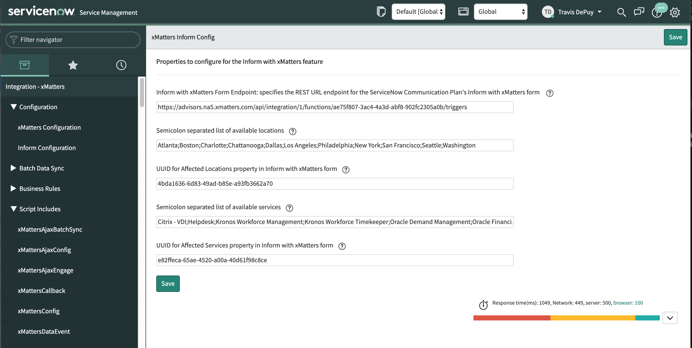

# Inform with xMatters for the ServiceNow integration
This is part of the xMatters Labs awesome listing. For others, see [here](https://github.com/xmatters/xMatters-Labs)

The [xMatters integration for ServiceNow](https://store.servicenow.com/sn_appstore_store.do#!/store/application/5950d7444f2231000e9fa88ca310c78c) provides a several find and assign workflows for tracking down responsible parties for an Incident. However, there are cases where the need for informing other people about an Incident or providing updates regarding an Incident are important. This is where Inform with xMatters comes in. It does not target any users and instead relies on [subscriptions](http://help.xmatters.com/OnDemand/user/subscriptions.htm) to determine who wants to be notified. 

<kbd>
  
</kbd>

# Pre-Requisites
* ServiceNow Fuji or Istanbul
* ServiceNow integration to [xMatters v3.7.11+](https://store.servicenow.com/sn_appstore_store.do#!/store/application/5950d7444f2231000e9fa88ca310c78c/3.7.12)
* xMatters account - If you don't have one, [get one](https://www.xmatters.com)!

# Files
* [ServiceNow36withInform.zip](ServiceNow36withInform.zip) - Communications Plan file. This contains all of the out of box ServiceNow forms, in addition to the Inform with xMatters form. 
* [Inform with xMatters - for SN 3.7.1.xml](Inform with xMatters - for SN 3.7.1.xml) - Update set containing the ServiceNow artifacts for enabling the Inform with xMatters functionality. 

# Installation
Login to ServiceNow and navigate to Retrieved Update Sets. Point to the [Inform with xMatters - for SN 3.7.1.xml](Inform with xMatters - for SN 3.7.1.xml). Preview the update set and commit. This is all net new records so there should not be any files overwritten. 

Login to xMatters and import the [ServiceNow36withInform.zip](ServiceNow36withInform.zip) file. This contains a new comm plan called "Servicenow 3.6 with Inform" and contains the Integration Builder script, form and properties for sending these notifications. If needed, the components can be copied to an existing comm plan manually. 

## Configure ServiceNow
Login to ServiceNow and expand the "Integration - xMatters" menu item. In the Configuration section, there is a new entry for "Inform Configuration":

<kbd>
  
</kbd>

| Item | Description |
| ----- | ----- |
| Inform with xMatters Form Endpoint | The Integration Builder endpoint for the "Inform with xMatters" inbound integration url |
| Available Locations | Semicolon separated list of locations to make available for selection |
| UUID for affected locations | er,... not used |
| Available Services | Semicolon separated list of services to make available for selection |
| UUID for affected services | also not used |

The Available Services and Available Locations values in the config page above will need to match what is available in the "affected_services" and "affected_locations" properties in the comm plan. Here:

<kbd>
  
</kbd>

## Configure xMatters
Make sure the `affected_locations` and the `affected_services` properties have been updated to contain the same entries as listed in the Inform with xMatters configuration page in ServiceNow. 

Create a subscription panel called Inform with xMatters and set the scope to only Inform with xMatters:

<kbd>
  
</kbd>

<kbd>
  
</kbd>

Then create the actual subscription records for the users who wish to be notified. 

   
# Testing
Login to ServiceNow and find an open Incident. There will be a new button called "Inform with xMatters". Push it and the Inform dialog will be displayed:

<kbd>
  
</kbd>

Populate all the relevant info and hit Submit. A helpful message will let you know you've done it successfully. 

<kbd>
  
</kbd>

And the email will come through:

<kbd>
  
</kbd>

# Troubleshooting
If the events are not making it into xMatters, then check out the System Logs in ServiceNow for any error messages. The Inform with xMatters workflow uses the same logging setting as the Incident workflow, so update the Logging setting in the main xMatters Configuration page to get more or less detail. 

If the events are making it into xMatters, review the Event logs to determine if any Subscription criteria were met. If not, make sure the subscription record was created for the appropriate user. If so, make sure the user's devices are all configured correctly. 

